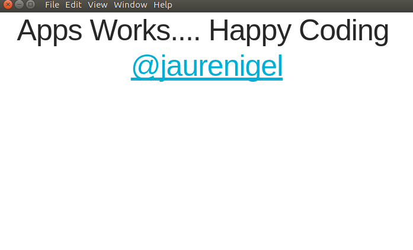

# Electron-Boilerplate

Basic boilerplate that can make your life easy when starting Electron based projects.
It aims for beginners, intermediate and those who want to create Electron app fast.

# How to use this boilerplate?

## Clone or Download Zip

### Run this on your terminal/cmd

```
  npm install
```
After installing dependencies, run the folling prompt

```j
  npm start
```
If Successfull your see the image below:



## Horay:smile:... You are ready to start your project

### Click the link below for the written version

https://nerd.creativelab.co.zw/snippets/electron/boilerplate.html - Here Is The Written Version!

# Happy Coding:beer: :coffee:
